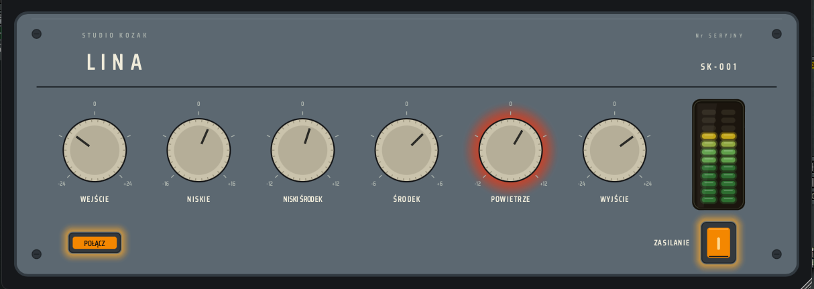

  

<h1 align="center">LINA</h1>

  <em>A tube EQ inspired by a forgotten name.</em>

  

  <strong>
    <a href="https://github.com/studiokozak/LINA/releases/latest">
      Download Latest Release
    </a>
  </strong>

---

## Overview

Legend has it that, many years ago, a Polish engineer designed an unusual tube equalizer and named it after herself.

Some swear they have heard it. Others insist she never existed.

This is **LINA**.

LINA is a fixed-voicing tube equalizer built for tone, color and musicality. It is not a surgical tool, nor is it designed to disappear into the signal path. Its purpose is simple: shape the sound, add character and make music a little more enjoyable.

---

## Features

* Four fixed EQ bands
* Tube-inspired saturation
* Dynamic tube bias behaviour
* Power supply sag simulation
* 4× oversampled tube processing
* Integrated EQ auto-gain compensation
* Input/Output linked gain staging
* Stereo peak meter
* VST3 (Windows & macOS)
* Audio Unit (macOS)
* Intel & Apple Silicon support

---

## Controls

### WEJŚCIE (Input)

Controls the signal level entering the tube stage. Higher settings generally increase coloration, harmonic content and overall attitude.

---

### NISKIE (Low)

Adds weight, body and foundation.

---

### NISKI ŚRODEK (Low Mid)

Shapes warmth, thickness and low-mid character.

---

### ŚRODEK (Mid)

Adds presence and forwardness.
Not quite what you might expect from a mid control.

---

### POWIETRZE (Air)

Adds brightness, openness and sparkle.

---

### WYJŚCIE (Output)

Adjusts the final output level and can be used to compensate for gain changes introduced by the EQ and tube stage.

---

### POŁĄCZ (Link)

Links the WEJŚCIE (Input) and WYJŚCIE (Output) controls. When enabled, increasing the input level automatically applies an opposite compensation to the output level, making it easier to explore the tube stage and compare different amounts of coloration without large changes in perceived loudness.

---

### Meter

Provides visual feedback on the output level while shaping tone and driving the tube stage.

---

### ZASILANIE (Power)

Engages or bypasses the processing.

---

## Philosophy

LINA was not designed to be precise. The frequencies are fixed, there are no hidden menus, no complex routing options and no endless preset lists.
Just a handful of controls.
Turn them.
Listen.
Trust your ears.

---

## Typical Applications

LINA may work particularly well on:

* Vocals
* Bass
* Acoustic instruments
* Drum buses
* Mix buses
* Synthesizers

And occasionally on sources where it probably shouldn't.

---

## System Requirements

### Windows

* Windows 10 or later
* VST3 compatible host
* VST3 format

### macOS

* macOS 11 Big Sur or later
* Intel or Apple Silicon
* VST3 and Audio Unit (AU) formats
* Compatible VST3 or Audio Unit host

---

## Installation

### Windows

Copy:

`LINA.vst3`

to:

`C:\Program Files\Common Files\VST3`

Then restart your DAW.

### macOS

#### VST3 Version

Copy:

`LINA.vst3`

to:

`/Library/Audio/Plug-Ins/VST3`

#### Audio Unit Version

Copy:

`LINA.component`

to:

`/Library/Audio/Plug-Ins/Components`

Then restart your DAW.

---

### macOS Security

LINA is built as a Universal Binary and supports both Intel and Apple Silicon Macs.
Depending on your macOS security settings, you may need to authorize the plugin manually the first time it is loaded.

---

## Notes

LINA is intended as a musical tone-shaping tool. If you are looking for transparent correction, there are many excellent equalizers available.
LINA was built for the moments when transparency is not the goal.
Like the engineer who may—or may not—have inspired it, LINA prefers character over perfection.

---

*Stéphan (Studio Kozak)*
